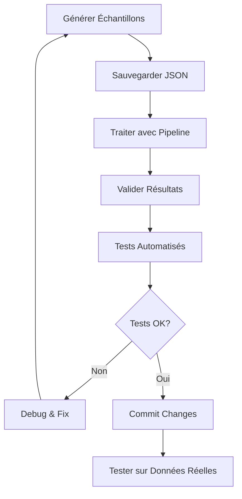

# Générateur de Données d'Échantillon - TheSession Database

## 🎯 Objectif

Créer des échantillons de données synthétiques qui respectent les types et structures des JSON réels de TheSession.org pour :

- **Tests unitaires** sur petits volumes
- **Validation du pipeline** de traitement
- **Développement itératif** sans dépendance aux données réelles
- **Benchmarks de performance** contrôlés

## 📊 Structure des Échantillons à Générer

### 🎼 Données Musicales (tunes.json)
```typescript
// Échantillon : 50 morceaux avec variations réalistes
interface SampleTune {
  id: string;           // "123", "456", etc.
  name: string;         // "The Cooley's Reel", "Drowsy Maggie"
  type: string;         // "reel", "jig", "hornpipe", "polka"
  user: {
    id: string;         // "789"
    name: string;       // "John O'Brien"
  };
  date: string;         // "2023-05-15"
  abc?: string;         // Notation ABC simplifiée
  aliases?: string[];   // Noms alternatifs
  settings: Array<{
    id: string;
    user: { id: string; name: string };
    abc: string;
    key: string;        // "Ador", "Gmaj", etc.
    meter: string;      // "4/4", "6/8", "9/8"
  }>;
}
```

### 🎵 Sets de Morceaux (sets.json)
```typescript
// Échantillon : 20 sets avec compositions variées
interface SampleSet {
  id: string;           // "set_001"
  name: string;         // "Popular Reels Set #1"
  user: {
    id: string;
    name: string;
  };
  date: string;
  tunes: Array<{
    id: string;         // Référence vers tunes
  }>;
}
```

### 🎧 Enregistrements (recordings.json)
```typescript
// Échantillon : 15 albums avec tracks
interface SampleRecording {
  id: string;           // "rec_001"
  name: string;         // "Traditional Music of Ireland"
  artist: string;       // "The Chieftains"
  user: {
    id: string;
    name: string;
  };
  date: string;
  tracks?: Array<{
    name: string;       // "Track 3: Medley of Reels"
    tunes?: Array<{
      id: string;       // Référence vers tunes
    }>;
  }>;
}
```

### 🌍 Sessions Géographiques (sessions.json & sessions.geojson)
```typescript
// Échantillon : 25 sessions dans différentes régions
interface SampleSession {
  id: string;           // "session_001"
  name: string;         // "Dublin Traditional Session"
  venue?: string;       // "O'Donoghue's Pub"
  town?: string;        // "Dublin"
  county?: string;      // "Dublin"
  country?: string;     // "Ireland"
  latitude?: number;    // 53.3398
  longitude?: number;   // -6.2603
  user: {
    id: string;
    name: string;
  };
  date: string;
}
```

### 🏷️ Alias (aliases.json)
```typescript
// Échantillon : 30 alias pour améliorer la recherche
interface SampleAlias {
  id: string;           // "alias_001"
  name: string;         // "Cooley's"
  tune: {
    id: string;         // Référence vers tune
  };
  user: {
    id: string;
    name: string;
  };
}
```

### 📈 Popularité (tune_popularity.json)
```typescript
// Échantillon : Scores de popularité calculés
interface SamplePopularity {
  tune_id: string;
  popularity_score: number;     // 0.0 à 1.0
  recording_count: number;      // Nombre d'albums
  session_mentions: number;     // Mentions dans sessions
  alias_count: number;          // Nombre d'alias
  setting_count: number;        // Nombre d'arrangements
}
```

## 🏗️ Générateur de Données - Architecture

### 1. **Générateur Principal (data-sample-generator.ts)**

```typescript
class TheSessionSampleGenerator {
  private config: SampleConfig;
  private faker: Faker;           // Library pour données réalistes
  
  constructor(config: SampleConfig) {
    this.config = config;
    this.faker = new Faker('en_IE'); // Locale irlandaise
  }
  
  // Point d'entrée principal
  async generateAllSamples(): Promise<SampleDataSet> {
    const users = this.generateUsers();
    const tunes = this.generateTunes(users);
    const sets = this.generateSets(tunes, users);
    const recordings = this.generateRecordings(tunes, users);
    const sessions = this.generateSessions(users);
    const aliases = this.generateAliases(tunes, users);
    const popularity = this.calculatePopularity(tunes, recordings, sessions);
    
    return {
      users,
      tunes,
      sets, 
      recordings,
      sessions,
      aliases,
      popularity
    };
  }
  
  // Génération avec relations cohérentes
  private generateTunes(users: SampleUser[]): SampleTune[] {
    return Array.from({ length: this.config.tuneCount }, (_, i) => ({
      id: `tune_${String(i + 1).padStart(3, '0')}`,
      name: this.generateTuneName(),
      type: this.selectRandomTuneType(),
      user: this.selectRandomUser(users),
      date: this.generateRandomDate(),
      abc: this.generateSimpleABC(),
      aliases: this.maybeGenerateAliases(),
      settings: this.generateSettings(users)
    }));
  }
  
  // Génération de notation ABC simplifiée
  private generateSimpleABC(): string {
    const keys = ['Ador', 'Gmaj', 'Dmaj', 'Amaj', 'Emaj'];
    const meters = ['4/4', '6/8', '9/8', '2/4'];
    const key = this.faker.arrayElement(keys);
    const meter = this.faker.arrayElement(meters);
    
    return `X:1\nT:${this.generateTuneName()}\nM:${meter}\nK:${key}\n${this.generateABCNotes()}`;
  }
  
  // Notes ABC basiques pour tests
  private generateABCNotes(): string {
    const notes = ['A', 'B', 'c', 'd', 'e', 'f', 'g', 'a', 'b'];
    const patterns = [
      'ABAG FGAF | GFGA Bcdg | bagf gfed | cAGE FGAB |',
      'cdef gabc | defg abcd | gfed cBAG | ABCD EFGA |',
      'Adcx Bcdx | GABc defg | fedc BcAG | FGAB cdef |'
    ];
    return this.faker.arrayElement(patterns);
  }
}
```

### 2. **Configuration des Échantillons (sample-config.ts)**

```typescript
interface SampleConfig {
  // Tailles des échantillons
  userCount: number;        // 20 utilisateurs fictifs
  tuneCount: number;        // 50 morceaux
  setCount: number;         // 20 sets
  recordingCount: number;   // 15 albums
  sessionCount: number;     // 25 sessions
  aliasCount: number;       // 30 alias
  
  // Paramètres de génération
  settingsPerTune: {        // 1-4 arrangements par morceau
    min: number;
    max: number;
  };
  
  tunesPerSet: {           // 2-5 morceaux par set
    min: number;
    max: number;
  };
  
  tracksPerRecording: {    // 8-15 pistes par album
    min: number;
    max: number;
  };
  
  // Distribution des types musicaux
  tuneTypeDistribution: {
    reel: number;          // 40%
    jig: number;           // 25%
    hornpipe: number;      // 15%
    polka: number;         // 10%
    waltz: number;         // 5%
    other: number;         // 5%
  };
  
  // Zones géographiques pour sessions
  geographicRegions: Array<{
    name: string;          // "Dublin", "Cork", "Galway"
    centerLat: number;
    centerLng: number;
    radiusKm: number;      // Dispersion autour du centre
  }>;
}

// Configuration par défaut pour développement
export const DEV_SAMPLE_CONFIG: SampleConfig = {
  userCount: 20,
  tuneCount: 50,
  setCount: 20,
  recordingCount: 15,
  sessionCount: 25,
  aliasCount: 30,
  
  settingsPerTune: { min: 1, max: 4 },
  tunesPerSet: { min: 2, max: 5 },
  tracksPerRecording: { min: 8, max: 15 },
  
  tuneTypeDistribution: {
    reel: 0.40,
    jig: 0.25,
    hornpipe: 0.15,
    polka: 0.10,
    waltz: 0.05,
    other: 0.05
  },
  
  geographicRegions: [
    { name: "Dublin", centerLat: 53.3498, centerLng: -6.2603, radiusKm: 25 },
    { name: "Cork", centerLat: 51.8985, centerLng: -8.4756, radiusKm: 20 },
    { name: "Galway", centerLat: 53.2707, centerLng: -9.0568, radiusKm: 15 },
    { name: "Belfast", centerLat: 54.5973, centerLng: -5.9301, radiusKm: 20 }
  ]
};
```

### 3. **Utilitaires de Génération (sample-utils.ts)**

```typescript
class SampleDataUtils {
  // Noms de morceaux irlandais traditionnels inspirés
  static TUNE_NAME_TEMPLATES = [
    "The {adjective} {noun}",
    "{person}'s {object}",
    "The {place} {tune_type}",
    "{adjective} {person}",
    "The {number} {objects}"
  ];
  
  static ADJECTIVES = [
    "Old", "Young", "Wild", "Fair", "Dark", "Bonny", "Bold",
    "Merry", "Lonesome", "Foggy", "Windy", "Golden", "Silver"
  ];
  
  static NOUNS = [
    "Reel", "Jig", "Hornpipe", "Dancer", "Fiddler", "Piper",
    "Road", "Hill", "Glen", "Bay", "Rose", "Blackbird"
  ];
  
  static IRISH_PLACES = [
    "Dublin", "Cork", "Galway", "Killarney", "Dingle",
    "Donegal", "Connemara", "Achill", "Sligo", "Kerry"
  ];
  
  static IRISH_NAMES = [
    "O'Brien", "Murphy", "Kelly", "O'Sullivan", "Walsh",
    "McCarthy", "Fitzgerald", "O'Connor", "Byrne", "Ryan"
  ];
  
  // Génération de coordonnées dans une région
  static generateCoordinatesInRegion(
    centerLat: number,
    centerLng: number,
    radiusKm: number
  ): { latitude: number; longitude: number } {
    const angle = Math.random() * 2 * Math.PI;
    const distance = Math.random() * radiusKm;
    
    const deltaLat = (distance / 111) * Math.cos(angle);
    const deltaLng = (distance / (111 * Math.cos(centerLat * Math.PI / 180))) * Math.sin(angle);
    
    return {
      latitude: Number((centerLat + deltaLat).toFixed(6)),
      longitude: Number((centerLng + deltaLng).toFixed(6))
    };
  }
  
  // Calcul de popularité basé sur les relations
  static calculatePopularityScore(
    tune: SampleTune,
    allRecordings: SampleRecording[],
    allSessions: SampleSession[],
    allAliases: SampleAlias[]
  ): number {
    const recordingMentions = allRecordings.filter(rec =>
      rec.tracks?.some(track =>
        track.tunes?.some(t => t.id === tune.id)
      )
    ).length;
    
    const aliasCount = allAliases.filter(alias => alias.tune.id === tune.id).length;
    const settingCount = tune.settings.length;
    
    // Score pondéré (0.0 à 1.0)
    return Math.min(1.0, (
      recordingMentions * 0.4 +      // Présence sur albums
      aliasCount * 0.3 +             // Noms alternatifs
      settingCount * 0.2 +           // Arrangements multiples
      Math.random() * 0.1            // Facteur aléatoire
    ));
  }
}
```

## 🧪 Stratégie de Tests

### 1. **Tests Unitaires (sample-generator.test.ts)**

```typescript
describe('TheSessionSampleGenerator', () => {
  let generator: TheSessionSampleGenerator;
  
  beforeEach(() => {
    generator = new TheSessionSampleGenerator(TEST_SAMPLE_CONFIG);
  });
  
  describe('generateTunes', () => {
    it('should generate correct number of tunes', () => {
      const users = generator.generateUsers();
      const tunes = generator.generateTunes(users);
      expect(tunes).toHaveLength(TEST_SAMPLE_CONFIG.tuneCount);
    });
    
    it('should respect tune type distribution', () => {
      const tunes = generator.generateTunes(generator.generateUsers());
      const reelCount = tunes.filter(t => t.type === 'reel').length;
      const expectedReels = TEST_SAMPLE_CONFIG.tuneCount * 0.4;
      expect(reelCount).toBeCloseTo(expectedReels, 0);
    });
    
    it('should generate valid ABC notation', () => {
      const tunes = generator.generateTunes(generator.generateUsers());
      tunes.forEach(tune => {
        if (tune.abc) {
          expect(tune.abc).toMatch(/^X:\d+/);  // Commence par X:
          expect(tune.abc).toContain('T:');     // Contient titre
          expect(tune.abc).toContain('M:');     // Contient meter
          expect(tune.abc).toContain('K:');     // Contient key
        }
      });
    });
  });
  
  describe('data relationships', () => {
    it('should maintain referential integrity', async () => {
      const sampleData = await generator.generateAllSamples();
      
      // Vérifier que tous les tune IDs dans sets existent
      sampleData.sets.forEach(set => {
        set.tunes.forEach(tuneRef => {
          const tuneExists = sampleData.tunes.some(t => t.id === tuneRef.id);
          expect(tuneExists).toBe(true);
        });
      });
      
      // Vérifier que tous les alias pointent vers des tunes existants
      sampleData.aliases.forEach(alias => {
        const tuneExists = sampleData.tunes.some(t => t.id === alias.tune.id);
        expect(tuneExists).toBe(true);
      });
    });
  });
});
```

### 2. **Tests d'Intégration (pipeline.test.ts)**

```typescript
describe('Data Processing Pipeline with Samples', () => {
  it('should process sample data through complete pipeline', async () => {
    // 1. Générer échantillons
    const generator = new TheSessionSampleGenerator(DEV_SAMPLE_CONFIG);
    const sampleData = await generator.generateAllSamples();
    
    // 2. Sauvegarder en fichiers JSON temporaires
    await saveSampleDataToFiles(sampleData, './test-data/');
    
    // 3. Traiter avec le pipeline réel
    const processor = new TheSessionDataProcessor();
    const stats = await processor.processAllData('./test-data/');
    
    // 4. Vérifier résultats
    expect(stats.tunes_processed).toBe(DEV_SAMPLE_CONFIG.tuneCount);
    expect(stats.sets_processed).toBe(DEV_SAMPLE_CONFIG.setCount);
    expect(stats.recordings_processed).toBe(DEV_SAMPLE_CONFIG.recordingCount);
    
    // 5. Nettoyer fichiers temporaires
    await cleanupTestData('./test-data/');
  });
});
```

## 🎯 Commandes de Génération

### 1. **Scripts NPM (package.json)**

```json
{
  "scripts": {
    "generate:samples": "ts-node src/sample-generator.ts",
    "generate:small": "ts-node src/sample-generator.ts --config small",
    "generate:large": "ts-node src/sample-generator.ts --config large",
    "test:samples": "jest --testPathPattern=sample",
    "test:pipeline": "npm run generate:samples && npm run process && npm run test:integration"
  }
}
```

### 2. **CLI du Générateur (sample-generator-cli.ts)**

```typescript
// Usage: npm run generate:samples -- --output ./samples --size small
async function main() {
  const args = parseCommandLineArgs();
  const config = loadConfig(args.size || 'dev');
  const outputDir = args.output || './generated-samples';
  
  const generator = new TheSessionSampleGenerator(config);
  const sampleData = await generator.generateAllSamples();
  
  // Sauvegarder dans structure de fichiers attendue
  await saveSampleFiles(sampleData, outputDir);
  
  console.log(`✅ Generated ${config.tuneCount} tunes, ${config.setCount} sets, etc.`);
  console.log(`📁 Files saved to: ${outputDir}/`);
  console.log(`🚀 Run: npm run process -- --input ${outputDir}`);
}
```

## 📈 Configurations d'Échantillon

### **Small** (Tests rapides)
```typescript
export const SMALL_SAMPLE_CONFIG: SampleConfig = {
  userCount: 5,
  tuneCount: 10,
  setCount: 3,
  recordingCount: 2,
  sessionCount: 5,
  aliasCount: 8
};
```

### **Medium** (Développement)
```typescript
export const MEDIUM_SAMPLE_CONFIG: SampleConfig = {
  userCount: 20,
  tuneCount: 50,
  setCount: 20,
  recordingCount: 15,
  sessionCount: 25,
  aliasCount: 30
};
```

### **Large** (Tests de performance)
```typescript
export const LARGE_SAMPLE_CONFIG: SampleConfig = {
  userCount: 100,
  tuneCount: 500,
  setCount: 150,
  recordingCount: 80,
  sessionCount: 200,
  aliasCount: 300
};
```

## 🔄 Workflow de Développement



### Avantages de cette Approche

✅ **Développement itératif** sans dépendance aux vraies données  
✅ **Tests déterministes** avec données contrôlées  
✅ **Validation rapide** sur petits volumes  
✅ **Debugging facilité** avec relations connues  
✅ **Performance mesurable** avec différentes tailles  
✅ **CI/CD compatible** pour tests automatisés  

Cette stratégie permet de valider complètement l'architecture avant de traiter les vraies données de TheSession.org.
